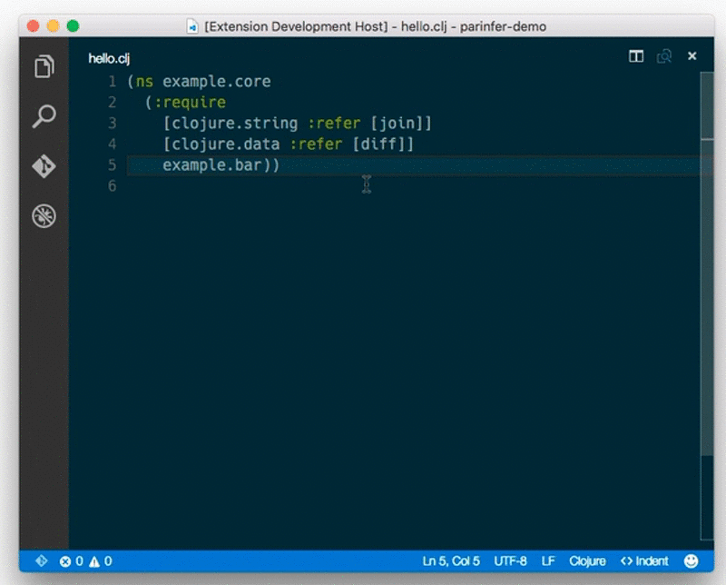

# Parinfer for Visual Studio Code  

A [Parinfer] package for [Visual Studio Code].

## Demo

### ChangeLog

[ChangeLog](https://github.com/shaunlebron/vscode-parinfer/releases)

## License

[MIT License](LICENSE.md)

[Parinfer]:http://shaunlebron.github.io/parinfer/
[Visual Studio Code]:https://code.visualstudio.com
